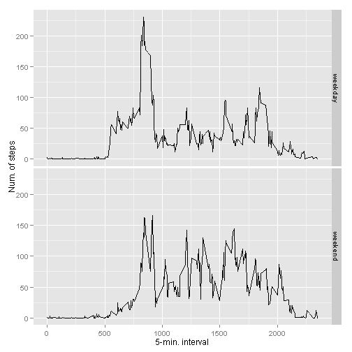

# Reproducible Research: Peer Assessment 1

## Loading and preprocessing the data


```r
if (!file.exists("activity.csv")) {
    unzip(zipfile="activity.zip")
}
data <- read.csv("activity.csv")
```
## What is mean total number of steps taken per day?

Calculate the the mean number of steps per day

```r
total.steps <- tapply(data$steps, data$date, FUN=sum, na.rm=TRUE)
mean(total.steps, na.rm=TRUE)
```

```
## [1] 9354
```

```r
median(total.steps, na.rm=TRUE)
```

```
## [1] 10395
```

Show the results in a plot

```r
library(ggplot2)
qplot(total.steps, binwidth=1000, xlab="total number of steps taken per day")
```

 
## What is the average daily activity pattern?

Calculate the mean steps for each five minute interval and show the time series plot.

```r
library(ggplot2)
averages <- aggregate(x=list(steps=data$steps), by=list(interval=data$interval),
FUN=mean, na.rm=TRUE)
ggplot(data=averages, aes(x=interval, y=steps)) +
        geom_line() +
        xlab("5-min. interval") +
        ylab("avg. number of steps")
```

 

Which 5-minute interval, on average across all the days in the dataset, contains the maximum number of steps?

```r
averages[which.max(averages$steps),]
```

```
##     interval steps
## 104      835 206.2
```

## Imputing missing values

Calculate and report the total number of missing values in the dataset.

```r
missing <- is.na(data$steps)
# Create table from missing values
table(missing)
```

```
## missing
## FALSE  TRUE 
## 15264  2304
```
All of the missing values are interpolated in with mean value for that 5-minute interval.
We also create a new dataset that is equal to the original dataset but with the missing data filled in.

```r
# Interpolate the missing value with the mean value of its 5-minute interval
interpolate.value <- function(steps, interval) {
  interpolated <- NA

  if (!is.na(steps)) {
    interpolated <- c(steps)
  }
  else {
    interpolated <- (averages[averages$interval==interval, "steps"])
  }

  return(interpolated)
}

interpolated.data <- data
interpolated.data$steps <- mapply(interpolate.value, interpolated.data$steps, interpolated.data$interval)
```
Make a histogram of the total number of steps taken each day and Calculate and report the mean and median total number of steps taken per day.

```r
total.steps <- tapply(interpolated.data$steps, interpolated.data$date, FUN=sum)
qplot(total.steps, binwidth=1000, xlab="total number of steps taken each day")
```

 

```r
mean(total.steps)
```

```
## [1] 10766
```

```r
median(total.steps)
```

```
## [1] 10766
```
Imputing the missing data has increased the average number of steps. 

## Are there differences in activity patterns between weekdays and weekends?
Find the day of the week for each measurement in the dataset. Use the dataset with the interpolated values.

```r
weekday.or.weekend <- function(date) {
  day <- weekdays(date)
  
  # Days in French
  if (day %in% c("lundi", "mardi", "mercredi", "jeudi", "vendredi")) {
    return("weekday")
  }
  else if (day %in% c("samedi", "dimanche")) {
    return("weekend")
  }
  else {
    stop("unknown day format")
  }
}

interpolated.data$date <- as.Date(interpolated.data$date)
interpolated.data$day <- sapply(interpolated.data$date, FUN=weekday.or.weekend)
```
Make a panel plot containing a time series plot. 

```r
averages <- aggregate(steps ~ interval + day, data=interpolated.data, mean)
ggplot(averages, aes(interval, steps)) + geom_line() + facet_grid(day ~ .) +
xlab("5-min. interval") + ylab("Num. of steps")
```

 
